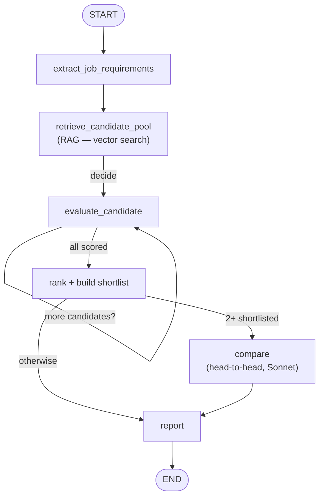

# CVecta — AI-powered CV screening & job-matching (RAG + LangGraph)

CVecta takes a job description, retrieves the most relevant CVs from a candidate
pool using vector search (RAG), scores each one against the role with an LLM, and
returns a ranked shortlist with reasoning — then runs a head-to-head comparison of
the top candidates to recommend a single best hire.

It's a demonstration of a production-shaped LLM pipeline: **retrieve-then-reason**
retrieval, structured (validated) LLM output, agentic orchestration with a real
decision loop, and an automated evaluation harness.

## Demo

> Paste a job description → get a ranked shortlist with matched/missing skills,
> a one-line verdict per candidate, and a recommended hire.

## Architecture

The pipeline is a [LangGraph](https://langchain-ai.github.io/langgraph/) state
graph. The `decide` router loops the `evaluate` node once per candidate; `rank`
then decides whether a head-to-head `compare` pass is warranted.



### How it works

1. **Extract** — the job description is parsed into structured requirements
   (title, required vs nice-to-have skills, min experience) using
   `with_structured_output` against a Pydantic schema.
2. **Retrieve (RAG)** — a query built from those requirements is run against a
   Chroma vector store of CV chunks. Cheap vector search narrows the pool to the
   most relevant candidates before any expensive reasoning.
3. **Evaluate** — each shortlisted CV is scored 0–100 against the role by an LLM,
   returning matched skills, missing skills, and a short verdict as structured data.
4. **Rank & compare** — results are ranked; if two or more clear the threshold, a
   smarter model does a head-to-head reasoning pass to pick the single best hire.

### Design notes

- **Retrieve-then-reason:** vector search is cheap and fast; LLM reasoning is
  expensive. Narrowing with retrieval first keeps cost down and scales to a large
  CV pool.
- **Model tiering:** a fast/cheap model (Haiku) does bulk extraction and scoring;
  a stronger model (Sonnet) is reserved for the final tie-break, where judgment
  matters most.
- **Structured output everywhere:** every LLM call returns a validated Pydantic
  object, not free text — so the rest of the pipeline is ordinary, reliable Python.

## Stack

- **Python**
- **LangChain** — structured LLM output, embeddings, vector-store integration
- **LangGraph** — pipeline orchestration with a decision loop
- **Chroma** — local persisted vector database
- **HuggingFace `all-MiniLM-L6-v2`** — local sentence embeddings (free, no API cost)
- **Pydantic** — schema-guided extraction and validation
- **Streamlit** — the demo UI
- **Anthropic Claude API** — the reasoning models

## Project structure

```
config.py        # loads env, creates the fast (Haiku) and smart (Sonnet) LLM clients
models.py        # Pydantic schemas: CandidateProfile, JobRequirements, MatchResult, ComparisonResult
extract.py       # structured extraction of candidates and job requirements
vectorstore.py   # builds / loads the Chroma vector store from the CV folder
matcher.py       # RAG retrieval + per-candidate LLM scoring
graph.py         # the LangGraph pipeline (the agentic core)
evaluate.py      # automated evaluation harness (positive, top-k and negative cases)
app.py           # Streamlit UI
cvs/             # candidate CVs (.txt)
```

## Running it

```bash
# 1. Clone and enter
git clone https://github.com/<your-username>/cv-screener-rag.git
cd cv-screener-rag

# 2. Create a virtual environment
python -m venv venv
venv\Scripts\activate        # Windows
# source venv/bin/activate   # macOS / Linux

# 3. Install dependencies
pip install -r requirements.txt

# 4. Add your Anthropic API key
echo ANTHROPIC_API_KEY=sk-ant-... > .env

# 5. Add some CVs as .txt files into cvs/, then build the vector store
python vectorstore.py

# 6. Launch the demo
streamlit run app.py
```

## Evaluation

The system is checked against known-correct answers:

```bash
python evaluate.py
```

Each test case pairs a job description with the candidate(s) that *should* win.
It asserts the right candidate is recommended, appears in the top-K, and that a
deliberately mismatched candidate stays **out** of the shortlist — a negative test
proving the system can reject, not just rank. The script exits non-zero on any
failure, so it works as a regression check in CI.

## Future improvements

- **Sharper scoring** — the current scorer can cluster strong candidates near the
  top; calibrating the scoring prompt (or adding a re-ranking step) would spread
  scores out and reduce reliance on the comparison node.
- **Real CV parsing** — ingest PDF and DOCX CVs directly instead of plain text.
- **Metadata filtering** — hard filters (location, work authorization, min years)
  before the LLM stage, so retrieval respects non-negotiables.
- **Async evaluation** — score candidates concurrently to cut latency.
- **Explainability** — surface which CV passages drove each score.
- **Deployment** — host the demo on Streamlit Community Cloud.

## Note

The CVs in this repo are synthetic, generated for demonstration. No real candidate
data is used.